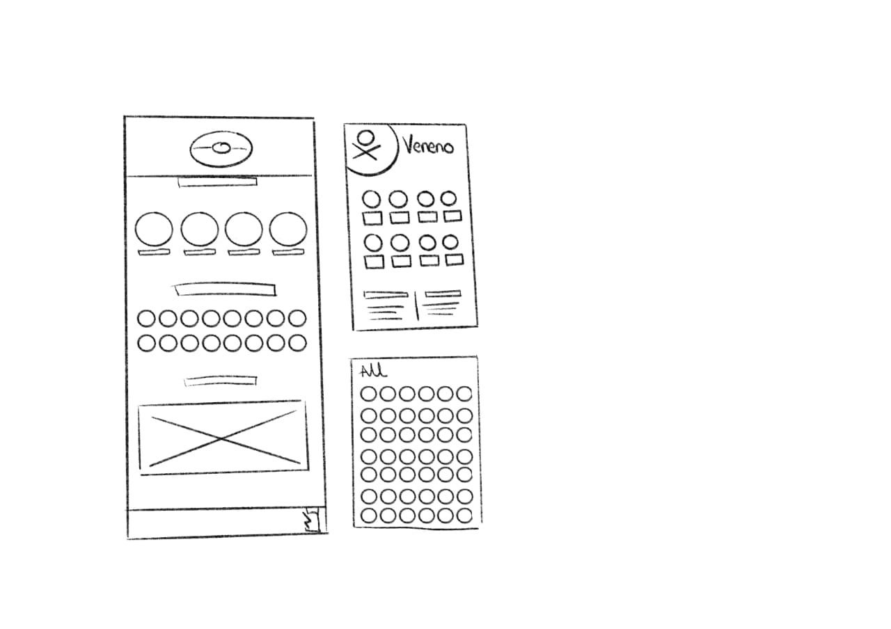
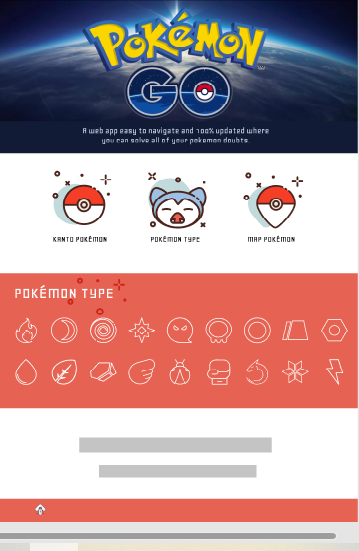
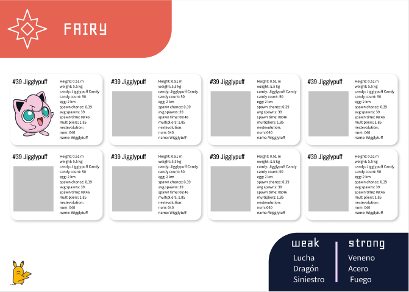

# Data Lovers - Pokémon Go

Elegimos el tema de pokémon ya que era algo en lo que ambas teníamos algo de conocimiento además de que son muy lindos.

## Proceso de Diseño

Desarrollamos un prototipo con una interfaz amigable y fácil de usar para el usuario ya que detectamos que las apps que existen para consular cualquier información relacionada a pokémon son muy sobrias, llenas de texto y bastante confusas.

Realizamos dos prototipos en papel y usamos la técnica del A/B testing en nuestro squad para conocer los pros y los contras de nuestros prototipos y así, usar el mejor.

Comenzamos a desarrollar nuestras historias de usuario que obtuvimos información a través de un Google Form donde preguntabamos como usuarios, qué les gustaría visualizar en una app de pokémon. 
De las respuestas que obtuvimos escogimos las tres más votadas y adaptamos el prototipo a estas.

 Puedes ver el form en este link [form](https://docs.google.com/forms/d/e/1FAIpQLScHCuzGJ8EpJCUeMCX2jTq_v5fTn-k7VaCgKjEzydMMx7HLqA/viewform?usp=sf_link)

## Historias de Usuario

1) Yo: Usuario de Pokemon 1
Quiero: Filtrar pokemones por su elemento
Para: El usuario puede filtrar por un elemento.
El usuario puede filtrar por dos elementos

2) Yo: Usuario de Pokemon 2
Quiero: Pode filtrar por debilidad
Para: El usuario puede filtrar a los pokemones por debilidad para saber cual puede ganar.

3) Yo: Usuario de Pokemon 3
Quiero: Ver las evoluciones de cada pokemon
Para: Comparar los cambios entre los pokemones

 

Posterior al desarrollo de las historias de usuario y al prototipado desarrollamos el mockup

 

 

Desde el prototipado hasta el mockup siempre pedimos el feedback de nuestras compañeras asegurandonos de que nuestra app cumpliera su propósito, fuera fácil de navegar y cumpliera los principios de diseño.

Y este fue nuestro resultado final: [Github pages](https://tangcherry.github.io/CDMX009-Data-Lovers/index.html)

## 3. Objetivos de aprendizaje

Pese a que nos costo un poquito de trabajo consideramos que cumplimos con la mayoría de los objetivos de aprendizaje, hay algunos que debido al tiempo no logramos alcanzar :(

### UX

- [✓] Diseñar la aplicación pensando y entendiendo al usuario.
- [✓] Crear prototipos para obtener _feedback_ e iterar.
- [✓] Aplicar los principios de diseño visual (contraste, alineación, jerarquía).
- [ ] Planear y ejecutar _tests_ de usabilidad.

### HTML y CSS

- [✓] Entender y reconocer por qué es importante el HTML semántico.
- [✓] Identificar y entender tipos de selectores en CSS.
- [✓] Entender como funciona `flexbox` en CSS.
- [✓] Construir tu aplicación respetando el diseño planeado (maquetación).

### DOM

- [ ] Entender y reconocer los selectores del DOM (querySelector | querySelectorAll).
- [✓] Manejar eventos del DOM. (addEventListener)
- [✓] Manipular dinámicamente el DOM. (createElement, appendchild, innerHTML, value)

### Javascript

- [ ] Manipular arrays (`filter` | `map` | `sort` | `reduce`).
- [✓] Manipular objects (key | value).
- [ ] Entender el uso de condicionales (`if-else` | `switch`).
- [✓] Entender el uso de bucles (`for` | `forEach`).
- [ ] Entender la diferencia entre expression y statements.
- [✓] Utilizar funciones (parámetros | argumentos | valor de retorno).
- [ ] Entender la diferencia entre tipos de datos atómicos y estructurados.
- [✓] Utilizar ES Modules (`import` | `export`).

### Pruebas Unitarias (_testing_)
- [ ] Testear funciones (funciones puras).

### Git y GitHub
- [✓] Ejecutar comandos de git (`add` | `commit` | `pull` | `status` | `push`).
- [✓] Utilizar los repositorios de GitHub (`clone` | `fork` | gh-pages).
- [✓] Colaborar en Github (pull requests).

### Buenas prácticas de desarrollo
- [✓] Organizar y dividir el código en módulos (Modularización).
- [✓] Utilizar identificadores descriptivos (Nomenclatura | Semántica).
- [ ] Utilizar linter para seguir buenas prácticas (ESLINT).